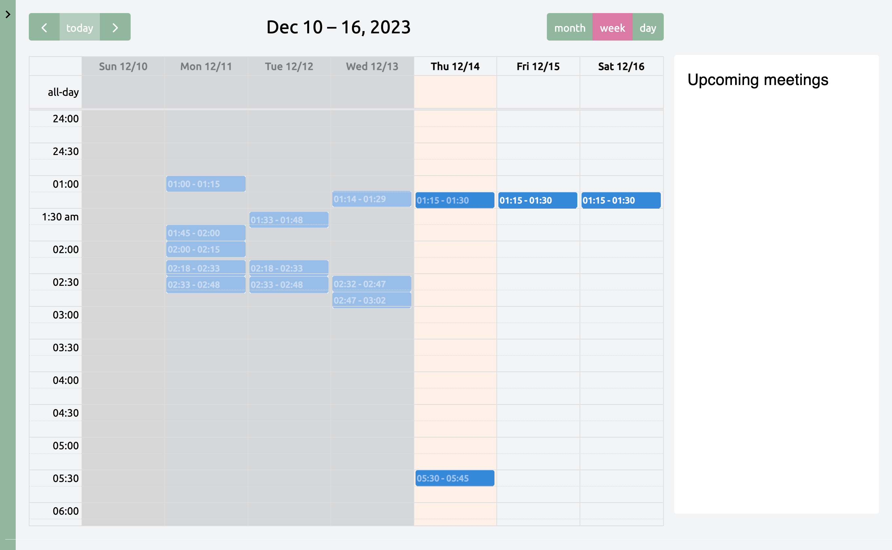
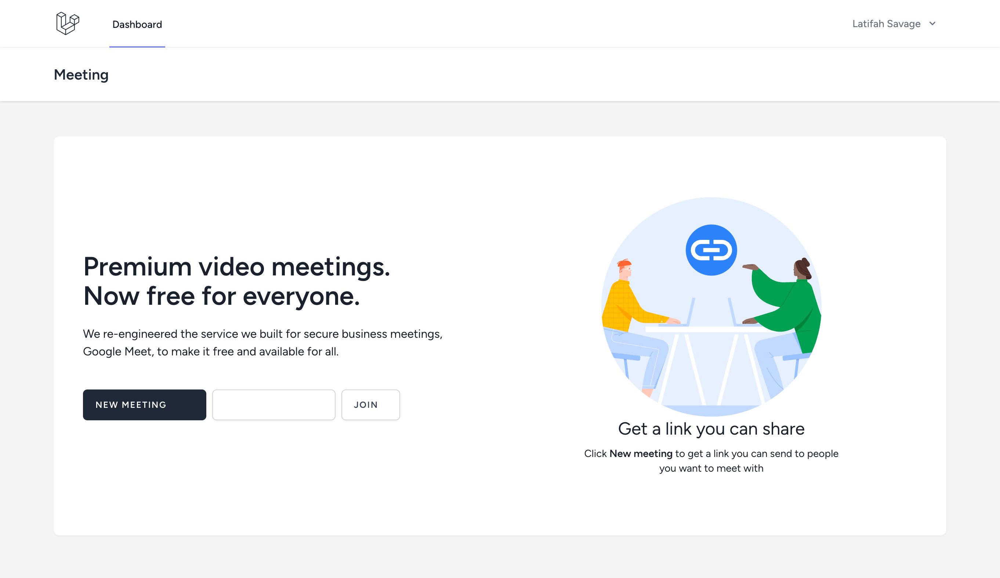

<h2 align="center">Hi there   I'm a Full Stack Developer with 6+ years of experience.</h2>

 

|  |  |  | 
| ------------- | ------------- | ------------- |

<h2>Connect with me</h2>

- 🌐 Blog: [Coding Tricks](https://codingtricks.co)
- 📧 Email: [kamleshpaul414@gmail.com](mailto:kamleshpaul414@gmail.com)
- 💼 LinkedIn: [in/kamleshpaul](http://linkedin.com/in/kamlesh-paul/)

---

## Skills
- 👨‍💻 **Languages**: Node.js, TypeScript, JavaScript, PHP, Python.
- ⚙️ **Frameworks & Libraries**: Next.js, React, Express.js, Laravel.
- 🎨 **Frontend**: Tailwind CSS, Bootstrap, Shadchan UI.
- 💽 **Databases**: MySQL, SQL, MongoDB.
- 🔌 **Integrations**: WebSocket, WebRTC, Stripe.
- 🚢 **Tools**: Docker.
- 🐧 **DevOps**: Linux Server Administration, Nginx, Caddy, AWS, Digital Ocean, DNS.

---

---

## My Recent Projects

  
<b>Vardforetag</b> (Click to expand/collapse)

  ### Description
  This project involves meeting management, allowing clients to create their availability on the calendar. Users can book meetings, and both parties receive notifications to join the meeting. The meeting can be either a video call or a voice call.

  ### Tools Used
  - Laravel, React.js, WebSocket, WebRTC, Tailwind CSS, Laravel Forge.

  ### Team Size
  - 1

  ### Screenshots
  
  

  
<b>Quiptgsm</b> (Click to expand/collapse)

  ### Description
  This project is an online dating course management system with real-time chat features between coaches and users. It also includes video courses.

  ### Tools Used
  - Laravel, Next.js, WebSocket, Tailwind CSS, Laravel Forge, FFmpeg.

  ### Team Size
  - 6

  ### Screenshots
  
  

  
<b>DCC</b> (Click to expand/collapse)

  ### Description
  This project is a drag-and-drop panel builder for Android devices.

  ### Tools Used
  - Laravel, Vue.js (2), WebSocket, Bootstrap CSS, AWS, MQTT.

  ### Team Size
  - 2

  ### Screenshots
  

  
<b>CoveredPress</b> (Click to expand/collapse)

  ### Description
  CoveredPress is a report generator for media agencies. It collects client interests, performs background data collection and calculations, and generates reports.

  ### Tools Used
  - Laravel, Bootstrap CSS, jQuery, AWS, various third-party APIs, Stripe.

  ### Team Size
  - 3

  ### Screenshots
  

  
<b>EmailEditor</b> (Click to expand/collapse)

  ### Description
  EmailEditor is a simple email builder and sender using SMTP.

  ### Tools Used
  - Laravel, React.js, Tailwind CSS.

  ### Team Size
  - 1

  ### Screenshots
  

  
<b>Google Meet Clone</b> (Click to expand/collapse)

  ### Description
  Google Meet Clone is a project focused on group video calls, replicating the features of Google Meet.

  ### Tools Used
  - Laravel, React.js, Tailwind CSS, WebSocket, WebRTC.

  ### Team Size
  - 1

  ### Screenshots
  

